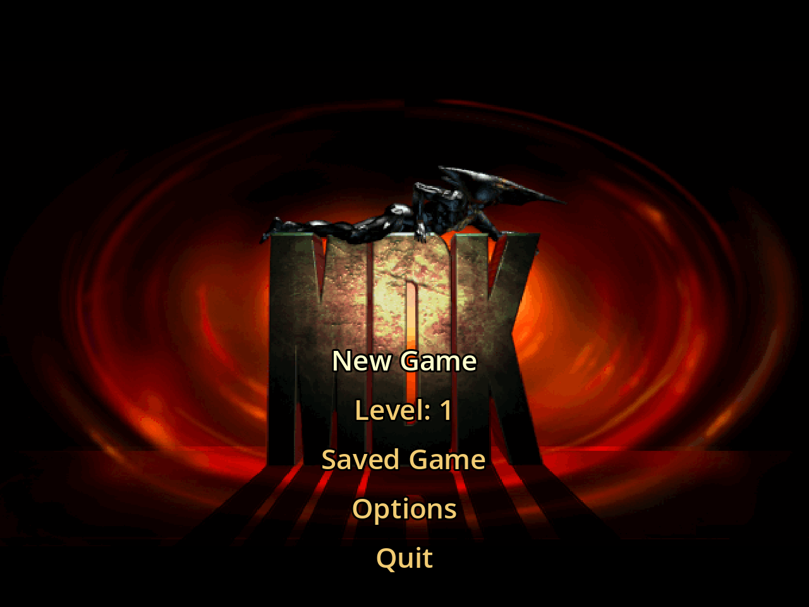
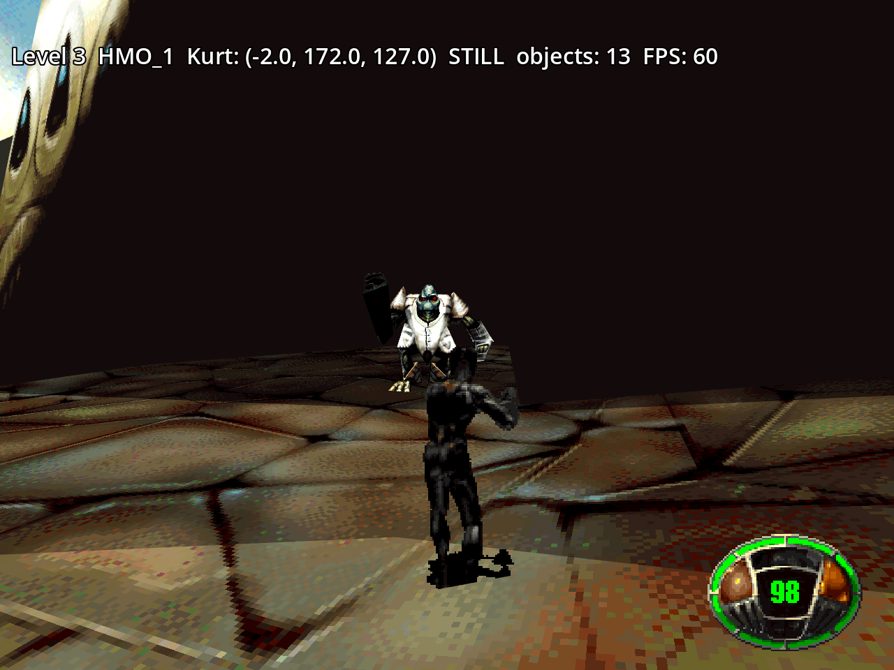
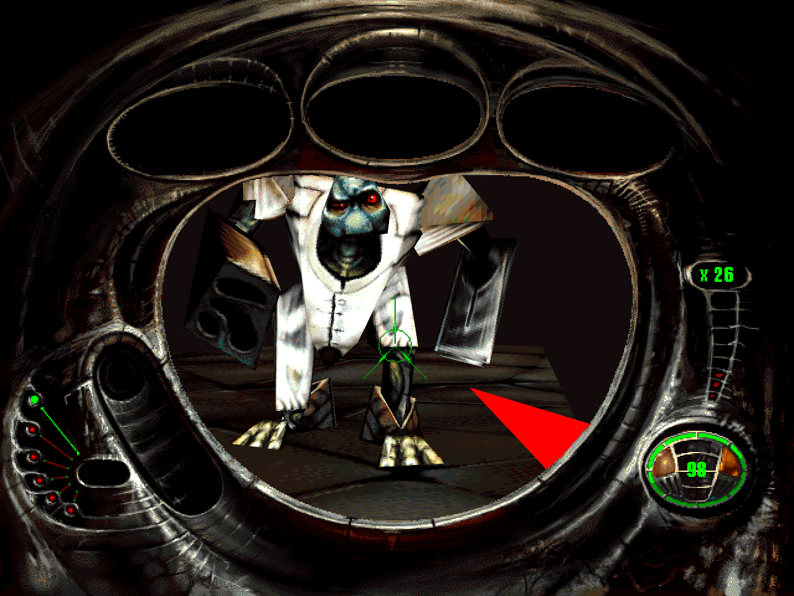
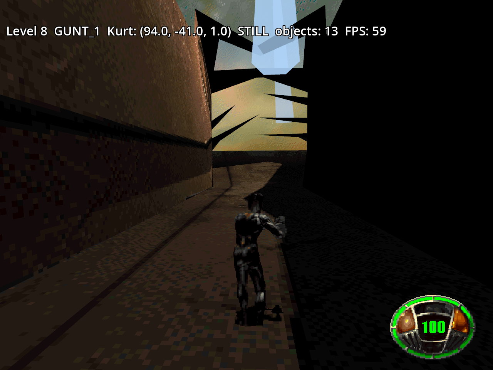
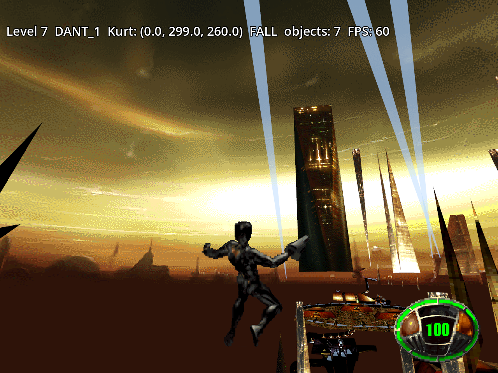
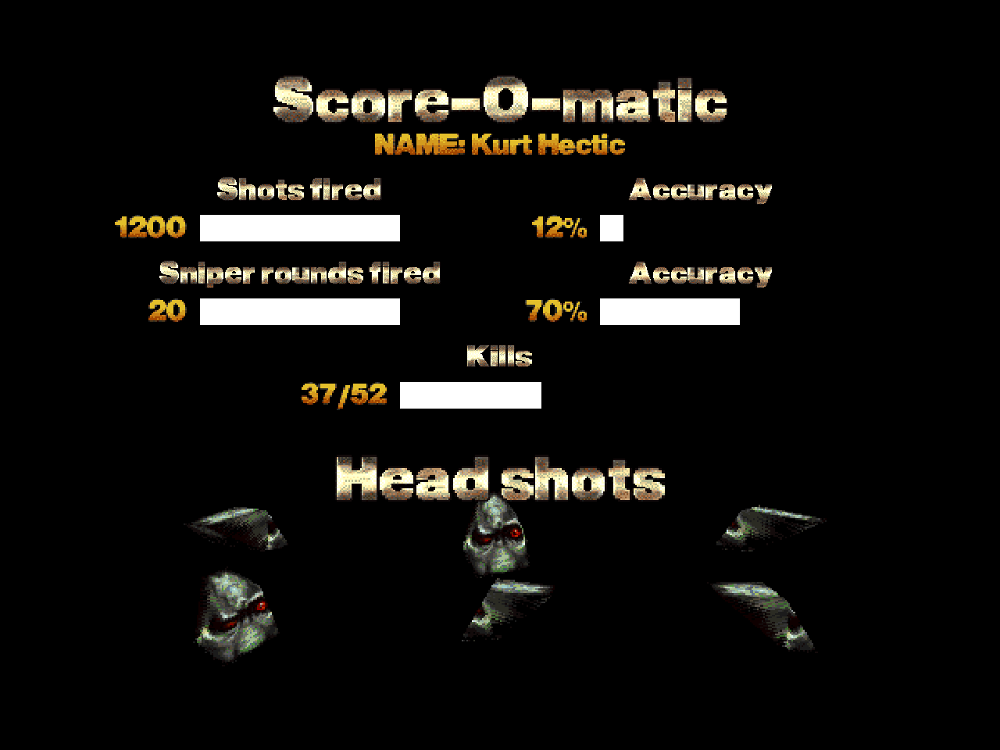
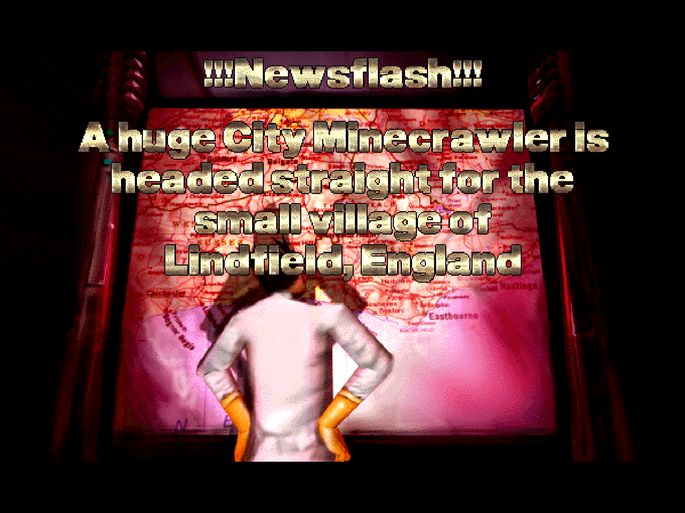

# MDK in Godot

A port of [MDK](https://en.wikipedia.org/wiki/MDK_(video_game)) (Shiny Entertainment, 1997) to
[Godot 4.7](https://godotengine.org/). It's based on reverse engineering the original game's data
files and executable (`MDKD3D.EXE`, the Direct3D version), and it aims to play like the original.

> [!IMPORTANT]
> **You need the original game to play.** This port contains no data from MDK: no levels,
> textures, models, sounds, music or videos. It reads them at run time from your own installed
> copy of the original game (available for example on GOG). Without the original game data the
> port won't run.

**Status: work in progress.** The six levels load and run with the original scripts, aliens,
weapons, items and sniper mode, but the game can't be played through from start to end yet, so
there's no release. See [the roadmap](docs/roadmap.md).

## Progress

| Area | Done |
| --- | --- |
| Data formats, levels, textures, skies | ██████████ 95% |
| Kurt: movement, camera, chute, sliding, ledges | █████████░ 90% |
| Script VM, aliens, doors, bosses, cutscenes | █████████░ 90% |
| Chain gun, items, sniper mode, air strike | █████████░ 90% |
| HUD, menus, options, key bindings | ████████░░ 80% |
| Sound and music | ██████░░░░ 60% |
| Level flow: briefing, statistics, saves | █████░░░░░ 50% |
| The fall (`FALL3D`) and the stream between levels | █░░░░░░░░░ 10% |
| End videos, enhanced graphics mode | ░░░░░░░░░░ 0% |
| **Overall** | **about 65%** |

## Screenshots

| | |
| --- | --- |
|  |  |
|  |  |
|  |  |
|  | |

## Running

The original game data is required and isn't included; you need your own copy of MDK (for example
from GOG). Place this project folder within the MDK installation folder (for example
`C:\GOG Games\MDK\godot-mdk`), install MDK in the default GOG location, or set the `MDK_DATA_DIR`
environment variable.

Open the project in Godot 4.7 and run it. Command line options (after `--`):

- `--level=N`: start `TRAVERSE/LEVELn` (3–8) directly, skipping the menu. The levels are played
  in the order 7, 6, 3, 4, 8, 5.
- `--viewer`: free-camera level viewer (`--camera=x,y,z`, `--look-at=x,y,z`).
- `--models`: model viewer (`--arena=NAME`).
- `--stats=N`, `--briefing=N`: the screens after LEVELn, or its briefing.
- `--screenshot=file.png`: save a screenshot and quit.
- `--profile=seconds`: print performance and script statistics, then quit. `--no-scripts` disables
  the scripts.

`game/main.gd` and `game/menu/main_menu.gd` list the other test options.

Controls (they can be changed in Options): W/S or Up/Down to run, A/D to strafe, the mouse or
Left/Right to turn, Space to jump (hold it while falling to open the chute), Shift for turbo, the
left mouse button or Ctrl to fire, the right mouse button for sniper mode (the mouse wheel or
PageUp/PageDown zoom), E or Enter to use the selected item (Tab, `[`, `]`, the mouse wheel or 1–5
select it), Escape for the pause menu. In the level viewer: WASD to move, Q/E to go down/up, click
to look around, Shift to go faster.

## Layout

- `mdk/`: MDK data formats (file parsers, palette, mesh building, shaders).
- `game/`: the game itself (menus, level, Kurt, camera, scripts runtime, HUD) and the level and
  model viewers.
- `docs/`: the knowledge base about MDK ([index](docs/README.md)): file formats, engine internals,
  Kurt's movement and camera, the script language and its VM, the level flow, and the roadmap.
- `tools/ghidra/`: Ghidra setup and scripts used for reverse engineering, and the names of
  reverse engineered functions.
- `tools/python/`: reference decoders used to validate formats.

## Legal

This is an unofficial fan project, not affiliated with Shiny Entertainment or the current rights
holders of MDK. MDK and its data are the property of their respective owners.

This repository contains only original code, documentation and tools. It doesn't include or
distribute any data from the game. To run the port you need a legally obtained copy of the
original MDK, whose installed data files the port loads.
