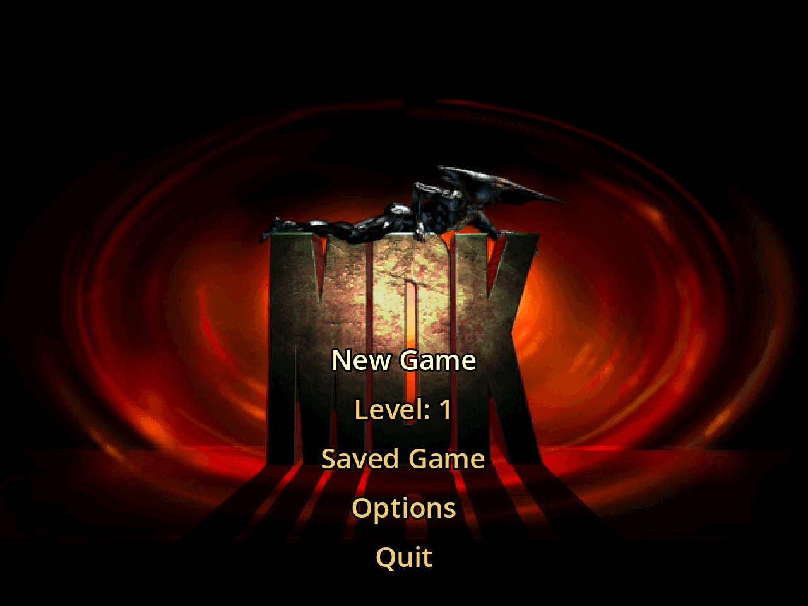
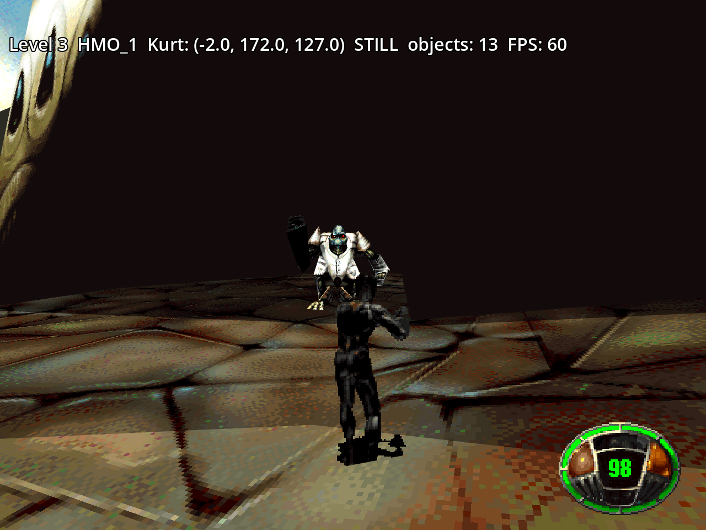
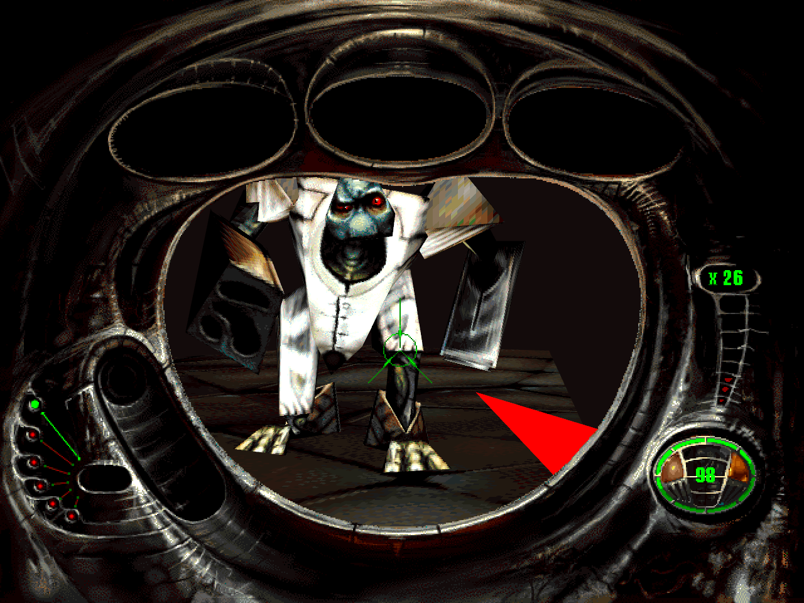
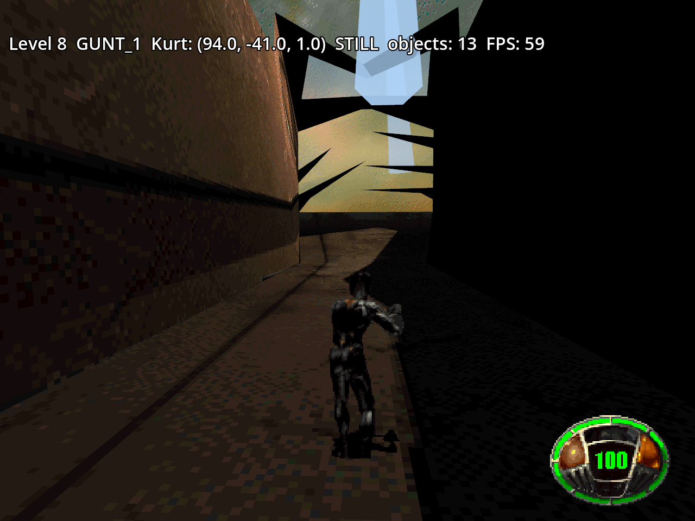
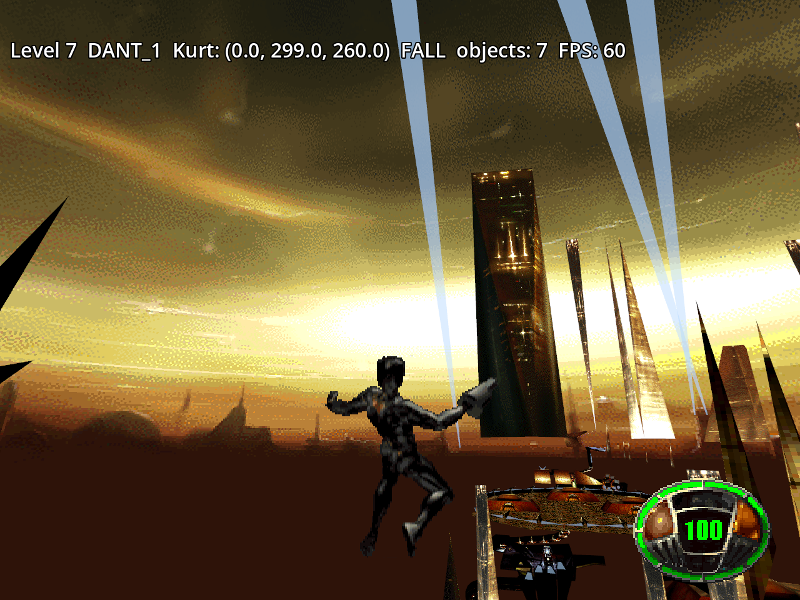
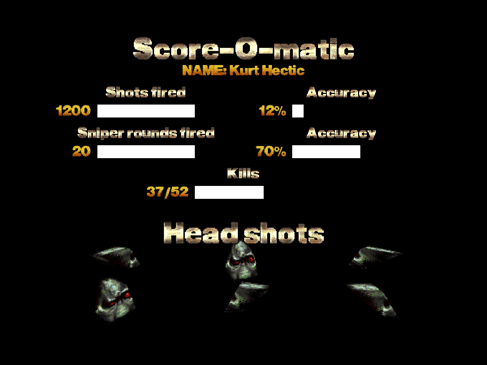
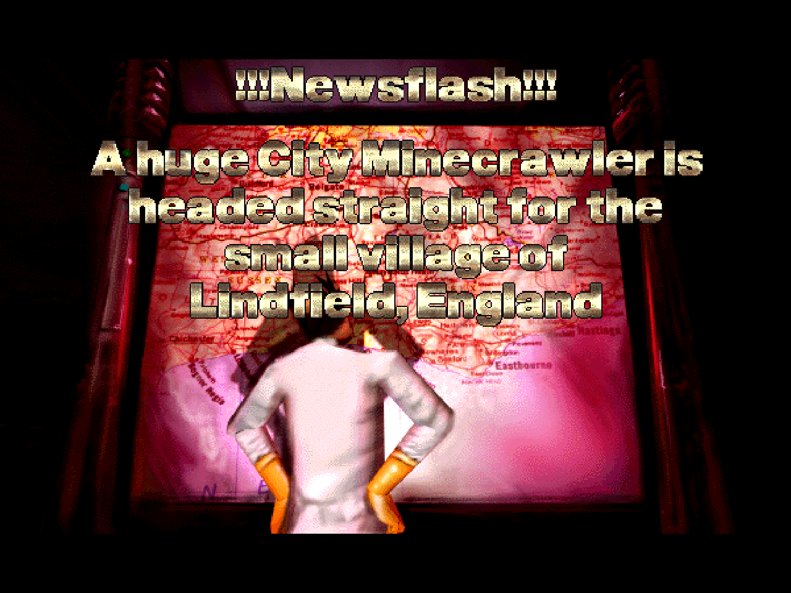

# MDK in Godot

> [!WARNING]
> **This Godot port is no longer actively developed.** The primary port is its successor,
> [mdk-sdl](https://github.com/nemo22/mdk-sdl) (C# and SDL3; Windows, Linux, macOS, Android; HD
> textures; [screenshots](https://github.com/nemo22/mdk-sdl#screenshots)). This repository stays
> for its reverse-engineering docs ([docs/](docs/)), which mdk-sdl uses.

A port of [MDK](https://en.wikipedia.org/wiki/MDK_(video_game)) (Shiny Entertainment, 1997) to
[Godot 4.7](https://godotengine.org/). It's based on reverse engineering the original game's data
files and executable (`MDKD3D.EXE`, the Direct3D version), and it aims to play like the original.

> [!IMPORTANT]
> **You need the original game to play.** This port contains no data from MDK: no levels,
> textures, models, sounds, music or videos. It reads them at run time from your own installed
> copy of the original game (available for example on GOG). Without the original game data the
> port won't run.

**Status: work in progress.** The six levels load and run with the original scripts, aliens,
weapons, items, rides and sniper mode, with the falls and streams between them, the briefings,
statistics and the end videos. It's being played through and its bugs fixed; there are
[alpha test builds](https://github.com/nemo22/mdk-godot/releases). See [the roadmap](docs/roadmap.md).

## Progress

| Area | Done |
| --- | --- |
| Data formats, levels, textures, skies, glass, mirrors | ██████████ 98% |
| Kurt: movement, camera, chute, sliding, ledges, rides | █████████░ 95% |
| Script VM, aliens, doors, bosses, cutscenes, arenas | █████████░ 96% |
| Chain gun, items, sniper mode, air strike | █████████░ 92% |
| HUD, menus (original font and layout), options, key bindings | █████████░ 90% |
| Sound and music | █████████░ 90% |
| Level flow: briefing, statistics, saves (also F2 full saves) | █████████░ 90% |
| The fall (`FALL3D`) and the stream between levels | █████████░ 90% |
| Intro and end videos (FLC, MVE) | ██████████ 100% |
| Enhanced graphics mode (lighting, filtering, shadows, SSAO, fog) | ███████░░░ 70% |
| Playtesting and bug fixing | ███████░░░ 70% |
| **Overall** | **about 90%** |

Recent work (0.10.0 alpha): fixes from playthroughs of every level, many shared with the
[C# port](https://github.com/nemo22/mdk-sdl). Kurt changes arena only through doorways, doors
move into his arena, teleports load the corridor behind them, and he rides moving platforms and
dies falling out of an arena. Objects collide only with their own arena and decide walls and
floors as the original; animations' root motion collides too (LEVEL4's `MEAT_5` key), objects
stop at their height offset and probe floors ahead (`if_no_floor_at`). LEVEL4's lift to
`MEAT_7` and its second board run, the slide, the board's steering, mortar rounds, sniper hits on
model faces, the chute's sound, fan sparks, coplanar details, glass outlines, system colours,
the cutscenes' screen flashes (LEVEL5's white veil after freeing Bones) and the fall's
explosions are fixed. The three levels of the 1996 beta demo play as extras.

## Screenshots

| | |
| --- | --- |
|  |  |
|  |  |
|  |  |
|  | |

## Downloads

Test builds for Windows, Linux and macOS are on the
[releases page](https://github.com/nemo22/mdk-godot/releases). Unpack one inside your MDK
installation folder (for example `C:\GOG Games\MDK\mdk-godot\mdk-godot.exe`), or set
`MDK_DATA_DIR` to that folder, and run it. Linux and macOS builds are untested; on macOS the app
isn't notarized (right-click it and choose Open the first time).

## Running

The original game data is required and isn't included; you need your own copy of MDK (for example
from GOG). Place this project folder within the MDK installation folder (for example
`C:\GOG Games\MDK\godot-mdk`), install MDK in the default GOG location, set the `MDK_DATA_DIR`
environment variable, or name the folder in a file `mdk_paths.cfg` next to `project.godot`
(`[paths]`, then `mdk="C:/Games/MDK"`; `beta="…"` for the 1996 demo).

Open the project in Godot 4.7 and run it. Command line options (after `--`):

- `--level=N`: start `TRAVERSE/LEVELn` (3–8) directly, skipping the menu. The levels are played
  in the order 7, 6, 3, 4, 8, 5.
- `--level=961`, `--level=963`, `--level=966`: the three levels of the beta demo of August 1996,
  if you have it (see [docs/beta96.md](docs/beta96.md)); the main menu's "Beta Levels" page starts them too.
- `--viewer`: free-camera level viewer (`--camera=x,y,z`, `--look-at=x,y,z`).
- `--models`: model viewer (`--arena=NAME`).
- `--stats=N`, `--briefing=N`, `--fall=N`, `--stream=N`: the screens after LEVELn, its briefing,
  the fall before it or the stream after it.
- `--screenshot=file.png`: save a screenshot and quit.
- `--enhanced` / `--original`: the graphics mode for this run.
- `--profile=seconds`: print performance and script statistics, then quit. `--no-scripts` disables
  the scripts.

`game/main.gd` and `game/menu/main_menu.gd` list the other test options.

Controls (they can be changed in Options): W/S or Up/Down to run, A/D to strafe, the mouse or
Left/Right to turn, Space to jump (hold it while falling to open the chute), Shift for turbo, the
left mouse button or Ctrl to fire, the right mouse button for sniper mode (the mouse wheel or
PageUp/PageDown zoom), E or Enter to use the selected item (Tab, `[`, `]`, the mouse wheel or 1–5
select it), Escape for the pause menu. In the fall before a level and the stream after it the
movement keys steer Kurt and Escape skips them. In the level viewer: WASD to move, Q/E to go down/up, click
to look around, Shift to go faster.

## A C# / SDL3 version

A rewrite of the port in C# on SDL3 has started: [mdk-sdl](https://github.com/nemo22/mdk-sdl). It renders and collides like
the original (its BSP, as described in [docs/bsp.md](docs/bsp.md)) instead of through Godot's
renderer and physics, and builds into a single native executable. It reuses this repository's
knowledge base; every level runs with its scripts and the game can be played through. Fixes
found in either port are carried over to the other.

## Layout

- `mdk/`: MDK data formats (file parsers, palette, mesh building, shaders).
- `game/`: the game itself (menus, level, Kurt, camera, scripts runtime, HUD) and the level and
  model viewers.
- `docs/`: the knowledge base about MDK ([index](docs/README.md)): file formats, engine internals,
  Kurt's movement and camera, the script language and its VM, the level flow, and the roadmap.
- `tools/ghidra/`: Ghidra setup and scripts used for reverse engineering, and the names of
  reverse engineered functions.
- `tools/python/`: reference decoders used to validate formats.
- `tests/`: tests: headless ones (`godot --headless --path . -s tests/<name>_test.gd`) and
  integration ones that run a level (`sh tests/<name>_test.sh <godot>`).

## Legal

This is an unofficial fan project, not affiliated with Shiny Entertainment or the current rights
holders of MDK. MDK and its data are the property of their respective owners.

This repository contains only original code, documentation and tools. It doesn't include or
distribute any data from the game. To run the port you need a legally obtained copy of the
original MDK, whose installed data files the port loads.

## Licence

Copyright © 2026 Marek Draškaba.

This program is free software: you can redistribute it and/or modify it
under the terms of the **GNU General Public License, version 3** as
published by the Free Software Foundation. It is distributed in the hope
that it will be useful, but WITHOUT ANY WARRANTY — without even the
implied warranty of MERCHANTABILITY or FITNESS FOR A PARTICULAR PURPOSE.
See [LICENSE](LICENSE) for the full text.

The licence covers **this port's own code**. It says nothing about the
original game's data, which belongs to its rights holders and is not
distributed here.
